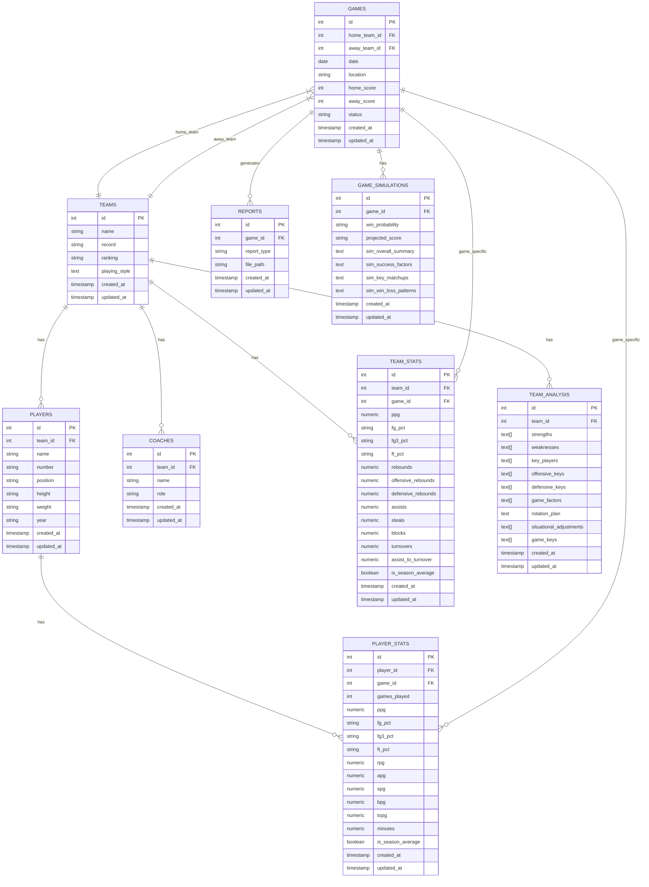

# Current AWS RDS Database Structure

This document provides a comprehensive overview of the current database structure in AWS RDS for the Basketball PDF Analysis Pipeline application.

## Table of Contents

1. [Database Schema Overview](#database-schema-overview)
2. [Entity-Relationship Diagram](#entity-relationship-diagram)
3. [Table Definitions](#table-definitions)
4. [Foreign Key Relationships](#foreign-key-relationships)
5. [Comparison with Ideal Structure](#comparison-with-ideal-structure)

## Database Schema Overview

The application currently uses a PostgreSQL database with the following tables:

1. **teams** - Stores information about basketball teams
2. **players** - Stores information about individual players
3. **coaches** - Stores information about team coaches
4. **games** - Stores information about scheduled or completed games
5. **team_stats** - Stores statistical data for teams
6. **player_stats** - Stores statistical data for individual players
7. **team_analysis** - Stores analysis results for teams
8. **game_simulations** - Stores game simulation results
9. **reports** - Stores generated reports

## Entity-Relationship Diagram

## Table Definitions

### teams

Stores information about basketball teams.

| Column | Type | Nullable | Description |
|--------|------|----------|-------------|
| id | INTEGER | NO | Primary key |
| name | VARCHAR(100) | NO | Team name |
| record | VARCHAR(20) | YES | Team record (e.g., "5-2") |
| ranking | VARCHAR(50) | YES | Team ranking |
| playing_style | TEXT | YES | Description of team's playing style |
| created_at | TIMESTAMP | YES | Record creation timestamp |
| updated_at | TIMESTAMP | YES | Record update timestamp |

### players

Stores information about individual players.

| Column | Type | Nullable | Description |
|--------|------|----------|-------------|
| id | INTEGER | NO | Primary key |
| team_id | INTEGER | YES | Foreign key to teams table |
| name | VARCHAR(100) | NO | Player name |
| number | VARCHAR(10) | YES | Player jersey number |
| position | VARCHAR(20) | YES | Player position |
| height | VARCHAR(10) | YES | Player height |
| weight | VARCHAR(10) | YES | Player weight |
| year | VARCHAR(20) | YES | Player's academic year |
| created_at | TIMESTAMP | YES | Record creation timestamp |
| updated_at | TIMESTAMP | YES | Record update timestamp |

### coaches

Stores information about team coaches.

| Column | Type | Nullable | Description |
|--------|------|----------|-------------|
| id | INTEGER | NO | Primary key |
| team_id | INTEGER | YES | Foreign key to teams table |
| name | VARCHAR(100) | NO | Coach name |
| role | VARCHAR(50) | YES | Coach role |
| created_at | TIMESTAMP | YES | Record creation timestamp |
| updated_at | TIMESTAMP | YES | Record update timestamp |

### games

Stores information about scheduled or completed games.

| Column | Type | Nullable | Description |
|--------|------|----------|-------------|
| id | INTEGER | NO | Primary key |
| home_team_id | INTEGER | YES | Foreign key to teams table for home team |
| away_team_id | INTEGER | YES | Foreign key to teams table for away team |
| date | DATE | YES | Game date |
| location | VARCHAR(100) | YES | Game location |
| home_score | INTEGER | YES | Home team score |
| away_score | INTEGER | YES | Away team score |
| status | VARCHAR(20) | YES | Game status (scheduled, completed, cancelled) |
| created_at | TIMESTAMP | YES | Record creation timestamp |
| updated_at | TIMESTAMP | YES | Record update timestamp |

### team_stats

Stores statistical data for teams.

| Column | Type | Nullable | Description |
|--------|------|----------|-------------|
| id | INTEGER | NO | Primary key |
| team_id | INTEGER | YES | Foreign key to teams table |
| game_id | INTEGER | YES | Foreign key to games table (NULL for season averages) |
| ppg | NUMERIC | YES | Points per game |
| fg_pct | VARCHAR(10) | YES | Field goal percentage |
| fg3_pct | VARCHAR(10) | YES | Three-point field goal percentage |
| ft_pct | VARCHAR(10) | YES | Free throw percentage |
| rebounds | NUMERIC | YES | Total rebounds per game |
| offensive_rebounds | NUMERIC | YES | Offensive rebounds per game |
| defensive_rebounds | NUMERIC | YES | Defensive rebounds per game |
| assists | NUMERIC | YES | Assists per game |
| steals | NUMERIC | YES | Steals per game |
| blocks | NUMERIC | YES | Blocks per game |
| turnovers | NUMERIC | YES | Turnovers per game |
| assist_to_turnover | NUMERIC | YES | Assist to turnover ratio |
| is_season_average | BOOLEAN | YES | Whether these stats are season averages |
| created_at | TIMESTAMP | YES | Record creation timestamp |
| updated_at | TIMESTAMP | YES | Record update timestamp |

### player_stats

Stores statistical data for individual players.

| Column | Type | Nullable | Description |
|--------|------|----------|-------------|
| id | INTEGER | NO | Primary key |
| player_id | INTEGER | YES | Foreign key to players table |
| game_id | INTEGER | YES | Foreign key to games table (NULL for season averages) |
| games_played | INTEGER | YES | Number of games played |
| ppg | NUMERIC | YES | Points per game |
| fg_pct | VARCHAR(10) | YES | Field goal percentage |
| fg3_pct | VARCHAR(10) | YES | Three-point field goal percentage |
| ft_pct | VARCHAR(10) | YES | Free throw percentage |
| rpg | NUMERIC | YES | Rebounds per game |
| apg | NUMERIC | YES | Assists per game |
| spg | NUMERIC | YES | Steals per game |
| bpg | NUMERIC | YES | Blocks per game |
| topg | NUMERIC | YES | Turnovers per game |
| minutes | NUMERIC | YES | Minutes per game |
| is_season_average | BOOLEAN | YES | Whether these stats are season averages |
| created_at | TIMESTAMP | YES | Record creation timestamp |
| updated_at | TIMESTAMP | YES | Record update timestamp |

### team_analysis

Stores analysis results for teams.

| Column | Type | Nullable | Description |
|--------|------|----------|-------------|
| id | INTEGER | NO | Primary key |
| team_id | INTEGER | YES | Foreign key to teams table |
| strengths | TEXT[] | YES | Array of team strengths |
| weaknesses | TEXT[] | YES | Array of team weaknesses |
| key_players | TEXT[] | YES | Array of key players |
| offensive_keys | TEXT[] | YES | Array of offensive keys |
| defensive_keys | TEXT[] | YES | Array of defensive keys |
| game_factors | TEXT[] | YES | Array of game factors |
| rotation_plan | TEXT | YES | Rotation plan |
| situational_adjustments | TEXT[] | YES | Array of situational adjustments |
| game_keys | TEXT[] | YES | Array of game keys |
| created_at | TIMESTAMP | YES | Record creation timestamp |
| updated_at | TIMESTAMP | YES | Record update timestamp |

### game_simulations

Stores game simulation results.

| Column | Type | Nullable | Description |
|--------|------|----------|-------------|
| id | INTEGER | NO | Primary key |
| game_id | INTEGER | YES | Foreign key to games table |
| win_probability | VARCHAR(100) | YES | Win probability |
| projected_score | VARCHAR(100) | YES | Projected score |
| sim_overall_summary | TEXT | YES | Overall summary of simulation |
| sim_success_factors | TEXT | YES | Success factors from simulation |
| sim_key_matchups | TEXT | YES | Key matchups from simulation |
| sim_win_loss_patterns | TEXT | YES | Win/loss patterns from simulation |
| created_at | TIMESTAMP | YES | Record creation timestamp |
| updated_at | TIMESTAMP | YES | Record update timestamp |

### reports

Stores generated reports.

| Column | Type | Nullable | Description |
|--------|------|----------|-------------|
| id | INTEGER | NO | Primary key |
| game_id | INTEGER | YES | Foreign key to games table |
| report_type | VARCHAR(50) | YES | Report type (team_analysis, opponent_analysis, game_analysis) |
| file_path | VARCHAR(255) | YES | Path to the report file |
| created_at | TIMESTAMP | YES | Record creation timestamp |
| updated_at | TIMESTAMP | YES | Record update timestamp |

## Foreign Key Relationships

| Table | Column | References | Referenced Column |
|-------|--------|------------|------------------|
| players | team_id | teams | id |
| coaches | team_id | teams | id |
| games | home_team_id | teams | id |
| games | away_team_id | teams | id |
| team_stats | team_id | teams | id |
| team_stats | game_id | games | id |
| player_stats | player_id | players | id |
| player_stats | game_id | games | id |
| team_analysis | team_id | teams | id |
| game_simulations | game_id | games | id |
| reports | game_id | games | id |

## Comparison with Ideal Structure

Comparing the current AWS RDS structure with the ideal structure defined in DB_STRUCTURE.md, there are several differences:

### Missing Tables

1. **users** - Table for storing user information
2. **player_raw_stats** - Table for storing raw statistical data for individual players
3. **player_projections** - Table for storing player projection data from game simulations
4. **simulation_details** - Table for storing detailed simulation results

### Missing Columns

1. **teams** table is missing:
   - `record_date` (DATE) - Date of the record from LLM analysis

2. **games** table is missing:
   - `user_id` (INTEGER) - Foreign key to users table

3. **team_stats** table is missing:
   - `fg_made` (NUMERIC) - Field goals made
   - `fg_attempted` (NUMERIC) - Field goals attempted
   - `fg3_made` (NUMERIC) - Three-point field goals made
   - `fg3_attempted` (NUMERIC) - Three-point field goals attempted
   - `ft_made` (NUMERIC) - Free throws made
   - `ft_attempted` (NUMERIC) - Free throws attempted

### Data Storage Implications

The current database structure does not store:

1. User authentication and ownership information
2. Raw player statistics from the LLM response
3. Player projection data from game simulations
4. Detailed simulation results

These missing elements mean that some data from the LLM responses is not being persisted in the database, which could limit the application's ability to provide detailed analysis and historical comparisons.
