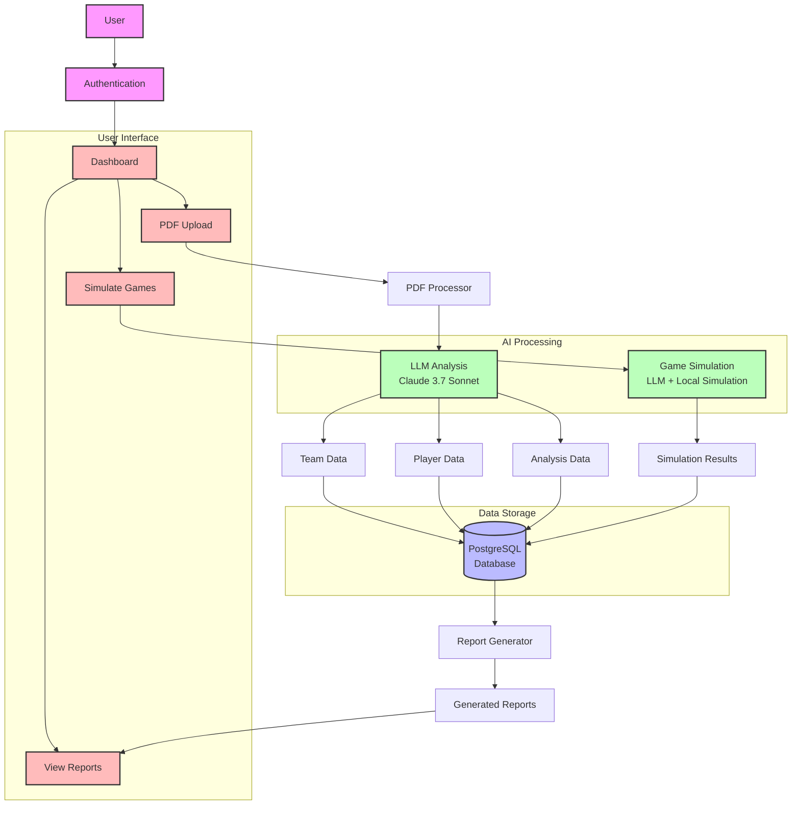
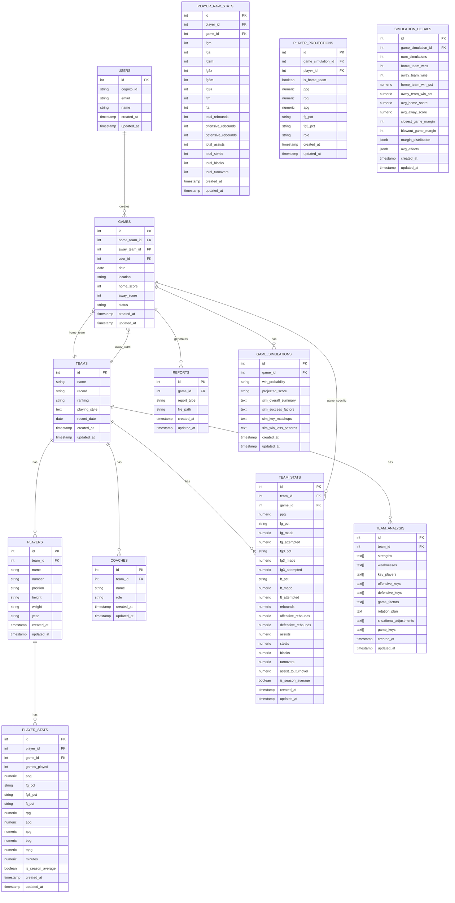

# Database Structure Documentation

This document provides a comprehensive overview of the database structure for the Basketball PDF Analysis Pipeline application. It includes the complete database schema, important database calls, and fields from LLM calls that should be stored in the database.

## Table of Contents

1. [Database Schema Overview](#database-schema-overview)
2. [Entity-Relationship Diagram](#entity-relationship-diagram)
3. [Table Definitions](#table-definitions)
4. [Team Analysis LLM Fields](#team-analysis-llm-fields)
5. [Game Simulation LLM Fields](#game-simulation-llm-fields)
6. [Database Calls Analysis](#database-calls-analysis)
7. [Schema Recommendations](#schema-recommendations)

## Database Schema Overview

The application uses a PostgreSQL database with the following tables:

1. **users** - Stores user information
2. **teams** - Stores information about basketball teams
3. **players** - Stores information about individual players
4. **coaches** - Stores information about team coaches
5. **games** - Stores information about scheduled or completed games
6. **team_stats** - Stores statistical data for teams
7. **player_stats** - Stores statistical data for individual players
8. **player_raw_stats** - Stores raw statistical data for individual players
9. **team_analysis** - Stores analysis results for teams
10. **game_simulations** - Stores game simulation results
11. **player_projections** - Stores player projection data from game simulations
12. **simulation_details** - Stores detailed simulation results
13. **reports** - Stores generated reports

## System Architecture Diagram



## Entity-Relationship Diagram



## Table Definitions

### users

Stores information about application users.

| Column | Type | Description |
|--------|------|-------------|
| id | SERIAL | Primary key |
| cognito_id | VARCHAR | Cognito user ID |
| email | VARCHAR | User email |
| name | VARCHAR | User name |
| created_at | TIMESTAMP | Record creation timestamp |
| updated_at | TIMESTAMP | Record update timestamp |

### teams

Stores information about basketball teams.

| Column | Type | Description |
|--------|------|-------------|
| id | SERIAL | Primary key |
| name | VARCHAR(100) | Team name |
| record | VARCHAR(20) | Team record (e.g., "5-2") |
| ranking | VARCHAR(50) | Team ranking |
| playing_style | TEXT | Description of team's playing style |
| record_date | DATE | Date of the record from LLM analysis |
| created_at | TIMESTAMP | Record creation timestamp |
| updated_at | TIMESTAMP | Record update timestamp |

### players

Stores information about individual players.

| Column | Type | Description |
|--------|------|-------------|
| id | SERIAL | Primary key |
| team_id | INTEGER | Foreign key to teams table |
| name | VARCHAR(100) | Player name |
| number | VARCHAR(10) | Player jersey number |
| position | VARCHAR(20) | Player position |
| height | VARCHAR(10) | Player height |
| weight | VARCHAR(10) | Player weight |
| year | VARCHAR(20) | Player's academic year |
| created_at | TIMESTAMP | Record creation timestamp |
| updated_at | TIMESTAMP | Record update timestamp |

### coaches

Stores information about team coaches.

| Column | Type | Description |
|--------|------|-------------|
| id | SERIAL | Primary key |
| team_id | INTEGER | Foreign key to teams table |
| name | VARCHAR(100) | Coach name |
| role | VARCHAR(50) | Coach role |
| created_at | TIMESTAMP | Record creation timestamp |
| updated_at | TIMESTAMP | Record update timestamp |

### games

Stores information about scheduled or completed games.

| Column | Type | Description |
|--------|------|-------------|
| id | SERIAL | Primary key |
| home_team_id | INTEGER | Foreign key to teams table for home team |
| away_team_id | INTEGER | Foreign key to teams table for away team |
| user_id | INTEGER | Foreign key to users table |
| date | DATE | Game date |
| location | VARCHAR(100) | Game location |
| home_score | INTEGER | Home team score |
| away_score | INTEGER | Away team score |
| status | VARCHAR(20) | Game status (scheduled, completed, cancelled) |
| created_at | TIMESTAMP | Record creation timestamp |
| updated_at | TIMESTAMP | Record update timestamp |

### team_stats

Stores statistical data for teams.

| Column | Type | Description |
|--------|------|-------------|
| id | SERIAL | Primary key |
| team_id | INTEGER | Foreign key to teams table |
| game_id | INTEGER | Foreign key to games table (NULL for season averages) |
| ppg | NUMERIC(5,1) | Points per game |
| fg_pct | VARCHAR(10) | Field goal percentage |
| fg_made | NUMERIC | Field goals made |
| fg_attempted | NUMERIC | Field goals attempted |
| fg3_pct | VARCHAR(10) | Three-point field goal percentage |
| fg3_made | NUMERIC | Three-point field goals made |
| fg3_attempted | NUMERIC | Three-point field goals attempted |
| ft_pct | VARCHAR(10) | Free throw percentage |
| ft_made | NUMERIC | Free throws made |
| ft_attempted | NUMERIC | Free throws attempted |
| rebounds | NUMERIC(5,1) | Total rebounds per game |
| offensive_rebounds | NUMERIC(5,1) | Offensive rebounds per game |
| defensive_rebounds | NUMERIC(5,1) | Defensive rebounds per game |
| assists | NUMERIC(5,1) | Assists per game |
| steals | NUMERIC(5,1) | Steals per game |
| blocks | NUMERIC(5,1) | Blocks per game |
| turnovers | NUMERIC(5,1) | Turnovers per game |
| assist_to_turnover | NUMERIC(5,2) | Assist to turnover ratio |
| is_season_average | BOOLEAN | Whether these stats are season averages |
| created_at | TIMESTAMP | Record creation timestamp |
| updated_at | TIMESTAMP | Record update timestamp |

### player_stats

Stores statistical data for individual players.

| Column | Type | Description |
|--------|------|-------------|
| id | SERIAL | Primary key |
| player_id | INTEGER | Foreign key to players table |
| game_id | INTEGER | Foreign key to games table (NULL for season averages) |
| games_played | INTEGER | Number of games played |
| ppg | NUMERIC(5,1) | Points per game |
| fg_pct | VARCHAR(10) | Field goal percentage |
| fg3_pct | VARCHAR(10) | Three-point field goal percentage |
| ft_pct | VARCHAR(10) | Free throw percentage |
| rpg | NUMERIC(5,1) | Rebounds per game |
| apg | NUMERIC(5,1) | Assists per game |
| spg | NUMERIC(5,1) | Steals per game |
| bpg | NUMERIC(5,1) | Blocks per game |
| topg | NUMERIC(5,1) | Turnovers per game |
| minutes | NUMERIC(5,1) | Minutes per game |
| is_season_average | BOOLEAN | Whether these stats are season averages |
| created_at | TIMESTAMP | Record creation timestamp |
| updated_at | TIMESTAMP | Record update timestamp |

### team_analysis

Stores analysis results for teams.

| Column | Type | Description |
|--------|------|-------------|
| id | SERIAL | Primary key |
| team_id | INTEGER | Foreign key to teams table |
| strengths | TEXT[] | Array of team strengths |
| weaknesses | TEXT[] | Array of team weaknesses |
| key_players | TEXT[] | Array of key players |
| offensive_keys | TEXT[] | Array of offensive keys |
| defensive_keys | TEXT[] | Array of defensive keys |
| game_factors | TEXT[] | Array of game factors |
| rotation_plan | TEXT | Rotation plan |
| situational_adjustments | TEXT[] | Array of situational adjustments |
| game_keys | TEXT[] | Array of game keys |
| created_at | TIMESTAMP | Record creation timestamp |
| updated_at | TIMESTAMP | Record update timestamp |

### game_simulations

Stores game simulation results.

| Column | Type | Description |
|--------|------|-------------|
| id | SERIAL | Primary key |
| game_id | INTEGER | Foreign key to games table |
| win_probability | VARCHAR(100) | Win probability |
| projected_score | VARCHAR(100) | Projected score |
| sim_overall_summary | TEXT | Overall summary of simulation |
| sim_success_factors | TEXT | Success factors from simulation |
| sim_key_matchups | TEXT | Key matchups from simulation |
| sim_win_loss_patterns | TEXT | Win/loss patterns from simulation |
| created_at | TIMESTAMP | Record creation timestamp |
| updated_at | TIMESTAMP | Record update timestamp |

### player_raw_stats

Stores raw statistical data for individual players.

| Column | Type | Description |
|--------|------|-------------|
| id | SERIAL | Primary key |
| player_id | INTEGER | Foreign key to players table |
| game_id | INTEGER | Foreign key to games table (NULL for season averages) |
| fgm | INTEGER | Field goals made |
| fga | INTEGER | Field goals attempted |
| fg2m | INTEGER | Two-point field goals made |
| fg2a | INTEGER | Two-point field goals attempted |
| fg3m | INTEGER | Three-point field goals made |
| fg3a | INTEGER | Three-point field goals attempted |
| ftm | INTEGER | Free throws made |
| fta | INTEGER | Free throws attempted |
| total_rebounds | INTEGER | Total rebounds |
| offensive_rebounds | INTEGER | Offensive rebounds |
| defensive_rebounds | INTEGER | Defensive rebounds |
| total_assists | INTEGER | Total assists |
| total_steals | INTEGER | Total steals |
| total_blocks | INTEGER | Total blocks |
| total_turnovers | INTEGER | Total turnovers |
| created_at | TIMESTAMP | Record creation timestamp |
| updated_at | TIMESTAMP | Record update timestamp |

### player_projections

Stores player projection data from game simulations.

| Column | Type | Description |
|--------|------|-------------|
| id | SERIAL | Primary key |
| game_simulation_id | INTEGER | Foreign key to game_simulations table |
| player_id | INTEGER | Foreign key to players table |
| is_home_team | BOOLEAN | Whether the player is on the home team |
| ppg | NUMERIC(5,1) | Projected points per game |
| rpg | NUMERIC(5,1) | Projected rebounds per game |
| apg | NUMERIC(5,1) | Projected assists per game |
| fg_pct | VARCHAR(10) | Projected field goal percentage |
| fg3_pct | VARCHAR(10) | Projected three-point percentage |
| role | VARCHAR(100) | Role description for the player in the game |
| created_at | TIMESTAMP | Record creation timestamp |
| updated_at | TIMESTAMP | Record update timestamp |

### simulation_details

Stores detailed simulation results.

| Column | Type | Description |
|--------|------|-------------|
| id | SERIAL | Primary key |
| game_simulation_id | INTEGER | Foreign key to game_simulations table |
| num_simulations | INTEGER | Number of simulations run |
| home_team_wins | INTEGER | Number of wins for home team |
| away_team_wins | INTEGER | Number of wins for away team |
| home_team_win_pct | NUMERIC(5,1) | Win percentage for home team |
| away_team_win_pct | NUMERIC(5,1) | Win percentage for away team |
| avg_home_score | NUMERIC(5,1) | Average score for home team |
| avg_away_score | NUMERIC(5,1) | Average score for away team |
| closest_game_margin | INTEGER | Margin of victory in closest game |
| blowout_game_margin | INTEGER | Margin of victory in blowout game |
| margin_distribution | JSONB | Distribution of game margins |
| avg_effects | JSONB | Average statistical effects on score |
| created_at | TIMESTAMP | Record creation timestamp |
| updated_at | TIMESTAMP | Record update timestamp |

### reports

Stores generated reports.

| Column | Type | Description |
|--------|------|-------------|
| id | SERIAL | Primary key |
| game_id | INTEGER | Foreign key to games table |
| report_type | VARCHAR(50) | Report type (team_analysis, opponent_analysis, game_analysis) |
| file_path | VARCHAR(255) | Path to the report file |
| created_at | TIMESTAMP | Record creation timestamp |
| updated_at | TIMESTAMP | Record update timestamp |

## Team Analysis LLM Fields

The application uses Claude 3.7 Sonnet to analyze team PDFs and extract insights. Below are all the fields returned by the LLM in the team analysis JSON structure, including fields calculated in post_process_team_stats.

### Team Analysis JSON Structure

```json
{
    "team_name": "String - Team name",
    "record_date": "String - Date of the record (yyyy-mm-dd)",
    "team_ranking": "String - Team ranking",
    "team_stats": {
        "PPG": "Number - Points per game",
        "FG%": "String - Field goal percentage",
        "3FG%": "String - Three-point field goal percentage",
        "FT%": "String - Free throw percentage",
        "REB": "Number - Total rebounds",
        "OREB": "Number - Offensive rebounds",
        "DREB": "Number - Defensive rebounds",
        "AST": "Number - Assists",
        "STL": "Number - Steals",
        "BLK": "Number - Blocks",
        "TO": "Number - Turnovers",
        "A/TO": "Number - Assist to turnover ratio"
    },
    "players": [
        {
            "name": "String - Player name",
            "number": "String - Player number",
            "position": "String - Player position",
            "stats": {
                "GP": "Number - Games played",
                "PPG": "Number - Points per game",
                "FG%": "String - Field goal percentage",
                "3FG%": "String - Three-point field goal percentage",
                "FT%": "String - Free throw percentage",
                "RPG": "Number - Rebounds per game",
                "APG": "Number - Assists per game",
                "SPG": "Number - Steals per game",
                "BPG": "Number - Blocks per game",
                "TOPG": "Number - Turnovers per game",
                "MINS": "Number - Minutes per game",
                "FGM": "Number - Field goals made",
                "FGA": "Number - Field goals attempted",
                "2FGM": "Number - Two-point field goals made",
                "2FGA": "Number - Two-point field goals attempted",
                "3FGM": "Number - Three-point field goals made",
                "3FGA": "Number - Three-point field goals attempted",
                "FTM": "Number - Free throws made",
                "FTA": "Number - Free throws attempted",
                "AST": "Number - Total Assists",
                "TO": "Number - Total Turnovers",
                "STL": "Number - Total Steals",
                "BLK": "Number - Total Blocks",
                "REB": "Number - Total Rebounds",
                "OREB": "Number - Total Offensive Rebounds",
                "DREB": "Number - Total Defensive Rebounds"
            },
            "strengths": ["String - Player strengths"],
            "weaknesses": ["String - Player weaknesses"]
        }
    ],
    "team_strengths": ["String - Team strengths"],
    "team_weaknesses": ["String - Team weaknesses"],
    "key_players": ["String - Key players"],
    "playing_style": "String - Team playing style",
    "offensive_keys": ["String - Offensive keys"],
    "defensive_keys": ["String - Defensive keys"],
    "game_factors": ["String - Game factors"],
    "rotation_plan": "String - Rotation plan",
    "situational_adjustments": ["String - Situational adjustments"],
    "game_keys": ["String - Game keys"]
}
```

### Post-Processed Fields

The `post_process_team_stats` function in anthropic_api.py calculates additional statistics that should be stored in the database:

1. **Field Goal Percentages**:
   - `FG%` - Calculated from FGM/FGA
   - `2FG%` - Calculated from 2FGM/2FGA
   - `3FG%` - Calculated from 3FGM/3FGA
   - `FT%` - Calculated from FTM/FTA

2. **Assist to Turnover Ratio**:
   - `A/TO` - Calculated from AST/TO

3. **Per Game Statistics**:
   - `BLK` - Blocks per game
   - `REB` - Rebounds per game
   - `OREB` - Offensive rebounds per game
   - `DREB` - Defensive rebounds per game
   - `AST` - Assists per game
   - `STL` - Steals per game

4. **Estimated Statistics**:
   - If `OREB` and `DREB` are missing but `REB` is available, they are estimated as 30% and 70% of `REB` respectively

### Mapping to Database Tables

| LLM Field | Database Table | Database Column |
|-----------|----------------|-----------------|
| team_name | teams | name |
| team_ranking | teams | ranking |
| playing_style | teams | playing_style |
| team_stats.PPG | team_stats | ppg |
| team_stats.FG% | team_stats | fg_pct |
| team_stats.3FG% | team_stats | fg3_pct |
| team_stats.FT% | team_stats | ft_pct |
| team_stats.REB | team_stats | rebounds |
| team_stats.OREB | team_stats | offensive_rebounds |
| team_stats.DREB | team_stats | defensive_rebounds |
| team_stats.AST | team_stats | assists |
| team_stats.STL | team_stats | steals |
| team_stats.BLK | team_stats | blocks |
| team_stats.TO | team_stats | turnovers |
| team_stats.A/TO | team_stats | assist_to_turnover |
| players[].name | players | name |
| players[].number | players | number |
| players[].position | players | position |
| players[].stats.GP | player_stats | games_played |
| players[].stats.PPG | player_stats | ppg |
| players[].stats.FG% | player_stats | fg_pct |
| players[].stats.3FG% | player_stats | fg3_pct |
| players[].stats.FT% | player_stats | ft_pct |
| players[].stats.RPG | player_stats | rpg |
| players[].stats.APG | player_stats | apg |
| players[].stats.SPG | player_stats | spg |
| players[].stats.BPG | player_stats | bpg |
| players[].stats.TOPG | player_stats | topg |
| players[].stats.MINS | player_stats | minutes |
| team_strengths | team_analysis | strengths |
| team_weaknesses | team_analysis | weaknesses |
| key_players | team_analysis | key_players |
| offensive_keys | team_analysis | offensive_keys |
| defensive_keys | team_analysis | defensive_keys |
| game_factors | team_analysis | game_factors |
| rotation_plan | team_analysis | rotation_plan |
| situational_adjustments | team_analysis | situational_adjustments |
| game_keys | team_analysis | game_keys |

## Game Simulation LLM Fields

The application uses Claude 3.7 Sonnet to simulate games between teams. Below are all the fields returned by the LLM in the game simulation JSON structure, including fields calculated in simulate_game_locally and runSimulations.

### Game Simulation JSON Structure

```json
{
    "sim_overall_summary": "String - A 1-2 sentence summary of the simulation results",
    "sim_success_factors": "String - A bullet list of key factors that contributed to each team's success",
    "sim_key_matchups": "String - A bullet list of critical player-vs-player or positional matchups",
    "sim_win_loss_patterns": "String - A bullet list of key patterns observed in the wins and losses",
    "win_probability": "String - The win probability for each team based on simulations",
    "projected_score": "String - The average projected score",
    "team_p1_name": "String - Name of team's player 1",
    "team_p1_ppg": "String - Projected points per game for team's player 1",
    "team_p1_rpg": "String - Projected rebounds per game for team's player 1",
    "team_p1_apg": "String - Projected assists per game for team's player 1",
    "team_p1_fg": "String - Projected field goal percentage for team's player 1",
    "team_p1_3p": "String - Projected three-point percentage for team's player 1",
    "team_p1_role": "String - Role description for team's player 1 in the game",
    "team_p2_name": "String - Name of team's player 2",
    "team_p2_ppg": "String - Projected points per game for team's player 2",
    "team_p2_rpg": "String - Projected rebounds per game for team's player 2",
    "team_p2_apg": "String - Projected assists per game for team's player 2",
    "team_p2_fg": "String - Projected field goal percentage for team's player 2",
    "team_p2_3p": "String - Projected three-point percentage for team's player 2",
    "team_p2_role": "String - Role description for team's player 2 in the game",
    "team_p3_name": "String - Name of team's player 3",
    "team_p3_ppg": "String - Projected points per game for team's player 3",
    "team_p3_rpg": "String - Projected rebounds per game for team's player 3",
    "team_p3_apg": "String - Projected assists per game for team's player 3",
    "team_p3_fg": "String - Projected field goal percentage for team's player 3",
    "team_p3_3p": "String - Projected three-point percentage for team's player 3",
    "team_p3_role": "String - Role description for team's player 3 in the game",
    "team_p4_name": "String - Name of team's player 4",
    "team_p4_ppg": "String - Projected points per game for team's player 4",
    "team_p4_rpg": "String - Projected rebounds per game for team's player 4",
    "team_p4_apg": "String - Projected assists per game for team's player 4",
    "team_p4_fg": "String - Projected field goal percentage for team's player 4",
    "team_p4_3p": "String - Projected three-point percentage for team's player 4",
    "team_p4_role": "String - Role description for team's player 4 in the game",
    "team_p5_name": "String - Name of team's player 5",
    "team_p5_ppg": "String - Projected points per game for team's player 5",
    "team_p5_rpg": "String - Projected rebounds per game for team's player 5",
    "team_p5_apg": "String - Projected assists per game for team's player 5",
    "team_p5_fg": "String - Projected field goal percentage for team's player 5",
    "team_p5_3p": "String - Projected three-point percentage for team's player 5",
    "team_p5_role": "String - Role description for team's player 5 in the game",
    "opp_p1_name": "String - Name of opponent's player 1",
    "opp_p1_ppg": "String - Projected points per game for opponent's player 1",
    "opp_p1_rpg": "String - Projected rebounds per game for opponent's player 1",
    "opp_p1_apg": "String - Projected assists per game for opponent's player 1",
    "opp_p1_fg": "String - Projected field goal percentage for opponent's player 1",
    "opp_p1_3p": "String - Projected three-point percentage for opponent's player 1",
    "opp_p1_role": "String - Role description for opponent's player 1 in the game",
    "opp_p2_name": "String - Name of opponent's player 2",
    "opp_p2_ppg": "String - Projected points per game for opponent's player 2",
    "opp_p2_rpg": "String - Projected rebounds per game for opponent's player 2",
    "opp_p2_apg": "String - Projected assists per game for opponent's player 2",
    "opp_p2_fg": "String - Projected field goal percentage for opponent's player 2",
    "opp_p2_3p": "String - Projected three-point percentage for opponent's player 2",
    "opp_p2_role": "String - Role description for opponent's player 2 in the game",
    "opp_p3_name": "String - Name of opponent's player 3",
    "opp_p3_ppg": "String - Projected points per game for opponent's player 3",
    "opp_p3_rpg": "String - Projected rebounds per game for opponent's player 3",
    "opp_p3_apg": "String - Projected assists per game for opponent's player 3",
    "opp_p3_fg": "String - Projected field goal percentage for opponent's player 3",
    "opp_p3_3p": "String - Projected three-point percentage for opponent's player 3",
    "opp_p3_role": "String - Role description for opponent's player 3 in the game",
    "opp_p4_name": "String - Name of opponent's player 4",
    "opp_p4_ppg": "String - Projected points per game for opponent's player 4",
    "opp_p4_rpg": "String - Projected rebounds per game for opponent's player 4",
    "opp_p4_apg": "String - Projected assists per game for opponent's player 4",
    "opp_p4_fg": "String - Projected field goal percentage for opponent's player 4",
    "opp_p4_3p": "String - Projected three-point percentage for opponent's player 4",
    "opp_p4_role": "String - Role description for opponent's player 4 in the game",
    "opp_p5_name": "String - Name of opponent's player 5",
    "opp_p5_ppg": "String - Projected points per game for opponent's player 5",
    "opp_p5_rpg": "String - Projected rebounds per game for opponent's player 5",
    "opp_p5_apg": "String - Projected assists per game for opponent's player 5",
    "opp_p5_fg": "String - Projected field goal percentage for opponent's player 5",
    "opp_p5_3p": "String - Projected three-point percentage for opponent's player 5",
    "opp_p5_role": "String - Role description for opponent's player 5 in the game"
}
```

### Local Simulation Fields

When using local simulation (`simulate_game_locally`), the following fields are calculated:

```json
{
    "numSimulations": "Number - Number of simulations run",
    "teamAWins": "Number - Number of wins for team A",
    "teamBWins": "Number - Number of wins for team B",
    "teamAWinPct": "Number - Win percentage for team A",
    "teamBWinPct": "Number - Win percentage for team B",
    "avgScoreA": "Number - Average score for team A",
    "avgScoreB": "Number - Average score for team B",
    "closestGame": {
        "teamAScore": "Number - Team A score in closest game",
        "teamBScore": "Number - Team B score in closest game",
        "winner": "String - Winner of closest game",
        "margin": "Number - Margin of victory in closest game",
        "gameNumber": "Number - Game number of closest game",
        "effects": {
            "rebounding": "Number - Rebounding effect on score",
            "fieldGoal": "Number - Field goal effect on score",
            "threePoint": "Number - Three-point effect on score",
            "turnovers": "Number - Turnovers effect on score",
            "assists": "Number - Assists effect on score",
            "steals": "Number - Steals effect on score",
            "blocks": "Number - Blocks effect on score",
            "total": "Number - Total effect on score"
        }
    },
    "blowoutGame": {
        "teamAScore": "Number - Team A score in blowout game",
        "teamBScore": "Number - Team B score in blowout game",
        "winner": "String - Winner of blowout game",
        "margin": "Number - Margin of victory in blowout game",
        "gameNumber": "Number - Game number of blowout game",
        "effects": {
            "rebounding": "Number - Rebounding effect on score",
            "fieldGoal": "Number - Field goal effect on score",
            "threePoint": "Number - Three-point effect on score",
            "turnovers": "Number - Turnovers effect on score",
            "assists": "Number - Assists effect on score",
            "steals": "Number - Steals effect on score",
            "blocks": "Number - Blocks effect on score",
            "total": "Number - Total effect on score"
        }
    },
    "marginDistribution": {
        "1-5 points": {
            "count": "Number - Count of games with margin 1-5 points",
            "percentage": "Number - Percentage of games with margin 1-5 points"
        },
        "6-10 points": {
            "count": "Number - Count of games with margin 6-10 points",
            "percentage": "Number - Percentage of games with margin 6-10 points"
        },
        "11-15 points": {
            "count": "Number - Count of games with margin 11-15 points",
            "percentage": "Number - Percentage of games with margin 11-15 points"
        },
        "16-20 points": {
            "count": "Number - Count of games with margin 16-20 points",
            "percentage": "Number - Percentage of games with margin 16-20 points"
        },
        "21+ points": {
            "count": "Number - Count of games with margin 21+ points",
            "percentage": "Number - Percentage of games with margin 21+ points"
        }
    },
    "avgEffects": {
        "rebounding": "Number - Average rebounding effect on score",
        "fieldGoal": "Number - Average field goal effect on score",
        "threePoint": "Number - Average three-point effect on score",
        "turnovers": "Number - Average turnovers effect on score",
        "assists": "Number - Average assists effect on score",
        "steals": "Number - Average steals effect on score",
        "blocks": "Number - Average blocks effect on score",
        "total": "Number - Average total effect on score"
    }
}
```

### Mapping to Database Tables

| LLM Field | Database Table | Database Column |
|-----------|----------------|-----------------|
| sim_overall_summary | game_simulations | sim_overall_summary |
| sim_success_factors | game_simulations | sim_success_factors |
| sim_key_matchups | game_simulations | sim_key_matchups |
| sim_win_loss_patterns | game_simulations | sim_win_loss_patterns |
| win_probability | game_simulations | win_probability |
| projected_score | game_simulations | projected_score |

The player projection fields (team_p1_name, team_p1_ppg, etc.) and local simulation fields (numSimulations, teamAWins, etc.) are currently not stored in the database schema.

## Database Calls Analysis

The application makes several important database calls to store and retrieve data. Below is an analysis of these calls and the fields they store.

### Team Management

1. **insert_team(team_data)**
   - Stores: team_name, team_record, team_ranking, playing_style
   - Table: teams
   - Source: LLM team analysis

2. **insert_team_stats(team_id, stats_data, game_id, is_season_average)**
   - Stores: team_id, game_id, is_season_average, ppg, fg_percentage, fg_made, fg_attempted, three_pt_percentage, three_pt_made, three_pt_attempted, ft_percentage, ft_made, ft_attempted, rebounds, offensive_rebounds, defensive_rebounds, assists, steals, blocks, turnovers, assist_to_turnover
   - Table: team_stats
   - Source: LLM team analysis and post-processed fields

3. **insert_team_analysis(team_id, analysis_data)**
   - Stores: team_id, strengths, weaknesses, key_players, offensive_keys, defensive_keys, game_factors, rotation_plan, situational_adjustments, game_keys
   - Table: team_analysis
   - Source: LLM team analysis

### Player Management

1. **insert_player(team_id, player_data)**
   - Stores: team_id, name, jersey_number, position
   - Table: players
   - Source: LLM team analysis

2. **insert_player_stats(player_id, stats_data, game_id, is_season_average)**
   - Stores: player_id, game_id, games_played, ppg, fg_pct, fg3_pct, ft_pct, rpg, apg, spg, bpg, topg, minutes, is_season_average
   - Table: player_stats
   - Source: LLM team analysis

### Game Management

1. **insert_game(home_team_id, away_team_id, user_id, date, location)**
   - Stores: home_team_id, away_team_id, user_id, date, location
   - Table: games
   - Source: User input and team analysis

2. **insert_game_simulation(game_id, simulation_data)**
   - Stores: game_id, win_probability, projected_score, sim_overall_summary, sim_success_factors, sim_key_matchups, sim_win_loss_patterns
   - Table: game_simulations
   - Source: LLM game simulation

### Report Management

1. **insert_report(game_id, report_type, file_path)**
   - Stores: game_id, report_type, file_path
   - Table: reports
   - Source: Generated reports

2. **get_recent_analyses(limit, user_id)**
   - Retrieves: Recent analyses with team names, scores, and report paths
   - Tables: games, teams, game_simulations, reports
   - Used for: Displaying recent analyses to users

### User Management

1. **get_or_create_user(cognito_id, email, name)**
   - Stores/Retrieves: cognito_id, email, name
   - Table: users
   - Source: Cognito authentication

## Schema Recommendations

Based on the analysis of the LLM fields and database schema, here are some observations about the current database structure:

1. **Player Projection Data**: The player projection data from game simulations (team_p1_name, team_p1_ppg, etc.) is not currently stored in the database.

2. **Detailed Simulation Results**: The local simulation produces detailed results that are not currently stored, such as margin distribution and statistical effects.

3. **Raw Player Statistics**: Some raw player statistics from the LLM response (FGM, FGA, etc.) are not explicitly stored in the player_stats table.

4. **Record Date**: The LLM response includes a record_date field that is not explicitly stored in the teams table.

The current database schema effectively stores the core information needed for the application's functionality, focusing on team and player information, game data, simulation results, and report management. The schema provides a solid foundation for the basketball analysis pipeline.
