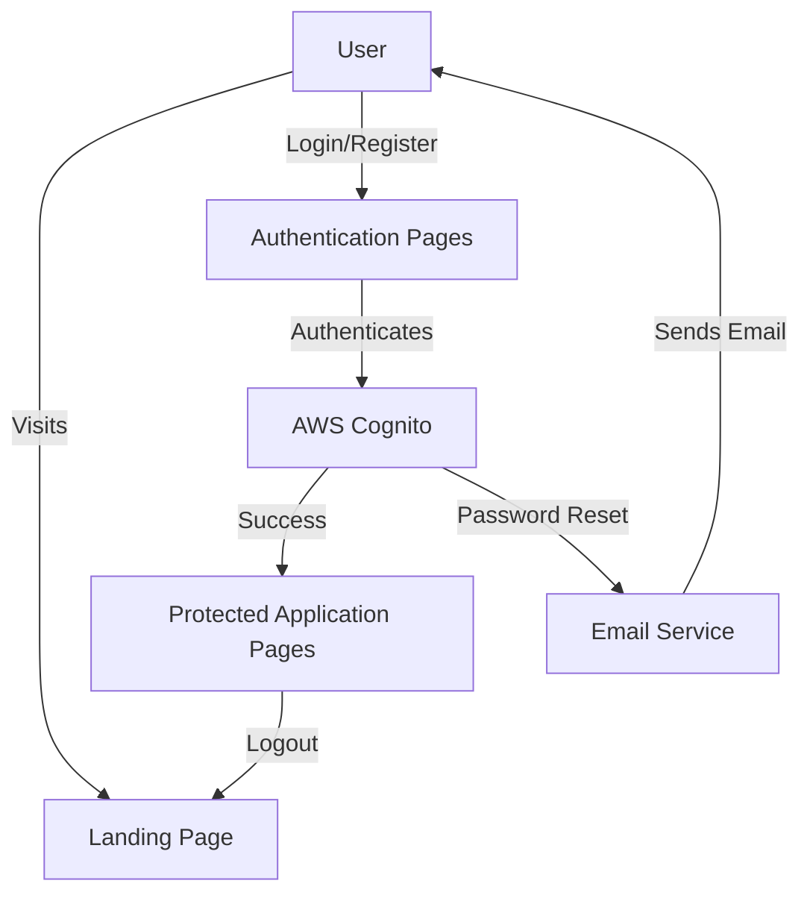

# Authentication Implementation Plan for Anova Sports Analytics

Based on the information gathered, this document outlines a detailed plan for implementing login, logout, and password recovery functionality using AWS Cognito for the Anova Sports Analytics application.

## 1. Overview

We'll implement a complete authentication system using AWS Cognito that will:
- Protect all application pages except the landing page
- Support user registration, login, logout, and password recovery
- Use a single user type (no complex role-based access)
- Send password recovery emails from no-reply@anovasports.com

## 2. Architecture



## 3. AWS Cognito Setup

1. **Create User Pool**
   - Set up a new Cognito User Pool in the AWS account
   - Configure standard password policies
   - Enable self-service sign-up
   - Configure email verification
   - Set up the no-reply@anovasports.com email for sending notifications

2. **Create App Client**
   - Create an app client within the user pool
   - Configure callback URLs
   - Set appropriate token expiration times
   - Enable required OAuth flows and scopes

3. **Configure Domain**
   - Set up a Cognito domain for hosted UI (optional)
   - Or configure custom domain if needed

## 4. Backend Implementation

1. **Add Required Dependencies**
   - Add AWS SDK for Python (boto3) to requirements.txt
   - Add python-jose for JWT token validation

2. **Create Authentication Router**
   - Create a new router file `app/routers/auth.py` for authentication endpoints
   - Implement routes for:
     - Login
     - Logout
     - Registration
     - Password reset request
     - Password reset confirmation

3. **Create Authentication Middleware**
   - Implement FastAPI middleware to validate JWT tokens
   - Protect all routes except the landing page
   - Handle token expiration and refresh

4. **Update Database Schema**
   - Add a users table to link Cognito users with application data
   - Add user_id foreign keys to relevant tables if needed

5. **Implement Cognito Service**
   - Create `app/services/cognito.py` to handle Cognito API interactions
   - Implement functions for user management, authentication, and token validation

## 5. Frontend Implementation

1. **Create Authentication Templates**
   - Create login page template based on mockup
   - Create registration page template based on mockup
   - Create password reset request page based on mockup
   - Create password reset confirmation page based on mockup
   - Create terms and conditions page

2. **Update Existing Templates**
   - Add logout button to authenticated pages
   - Add user information display where appropriate
   - Update navigation to reflect authentication state

3. **Add Client-Side Validation**
   - Implement form validation for all authentication forms
   - Add appropriate error handling and user feedback

## 6. Infrastructure Updates

1. **Update Terraform Configuration**
   - Add Cognito User Pool resource
   - Add Cognito App Client resource
   - Configure appropriate IAM permissions
   - Add environment variables for Cognito configuration

2. **Update Environment Variables**
   - Add Cognito-related environment variables to the ECS task definition
   - Update local development environment setup

## 7. Testing Plan

1. **Unit Tests**
   - Test authentication service functions
   - Test protected route middleware
   - Test token validation and refresh

2. **Integration Tests**
   - Test complete authentication flows
   - Test password reset flow
   - Test token expiration and refresh

3. **Manual Testing**
   - Verify all UI elements match the mockups
   - Test all authentication flows manually
   - Verify email delivery for password reset

## 8. Deployment Plan

1. **Development Deployment**
   - Deploy updated infrastructure with Terraform
   - Deploy updated application code
   - Verify functionality in development environment

2. **Production Deployment**
   - Update production infrastructure
   - Deploy to production
   - Verify functionality in production environment

## 9. Timeline and Milestones

1. **Phase 1: Setup and Infrastructure (2 days)**
   - Set up AWS Cognito User Pool
   - Update Terraform configuration
   - Create authentication service

2. **Phase 2: Backend Implementation (3 days)**
   - Create authentication router
   - Implement middleware
   - Update database schema

3. **Phase 3: Frontend Implementation (3 days)**
   - Create authentication templates
   - Update existing templates
   - Add client-side validation

4. **Phase 4: Testing and Deployment (2 days)**
   - Execute testing plan
   - Deploy to development
   - Deploy to production

## 10. Technical Details

### AWS Cognito Configuration

```terraform
resource "aws_cognito_user_pool" "anova_pool" {
  name = "anova-user-pool"
  
  username_attributes      = ["email"]
  auto_verified_attributes = ["email"]
  
  password_policy {
    minimum_length    = 8
    require_lowercase = true
    require_numbers   = true
    require_symbols   = true
    require_uppercase = true
  }
  
  schema {
    attribute_data_type = "String"
    name                = "name"
    required            = true
    mutable             = true
  }
  
  schema {
    attribute_data_type = "String"
    name                = "phone_number"
    required            = true
    mutable             = true
  }
  
  schema {
    attribute_data_type = "String"
    name                = "custom:school"
    required            = true
    mutable             = true
  }
  
  schema {
    attribute_data_type = "String"
    name                = "custom:role"
    required            = true
    mutable             = true
  }
  
  email_configuration {
    email_sending_account = "DEVELOPER"
    from_email_address    = "no-reply@anovasports.com"
    source_arn            = aws_ses_email_identity.no_reply.arn
  }
}

resource "aws_cognito_user_pool_client" "anova_client" {
  name = "anova-app-client"
  
  user_pool_id = aws_cognito_user_pool.anova_pool.id
  
  generate_secret     = true
  explicit_auth_flows = ["ALLOW_USER_PASSWORD_AUTH", "ALLOW_REFRESH_TOKEN_AUTH"]
  
  callback_urls = ["https://${aws_lb.app.dns_name}/auth/callback"]
  logout_urls   = ["https://${aws_lb.app.dns_name}/"]
}
```

### Authentication Middleware

```python
from fastapi import Request, HTTPException, Depends
from fastapi.security import OAuth2PasswordBearer
from fastapi.responses import RedirectResponse
from app.services.cognito import verify_token
from starlette.middleware.base import BaseHTTPMiddleware

oauth2_scheme = OAuth2PasswordBearer(tokenUrl="token")

class AuthMiddleware(BaseHTTPMiddleware):
    async def dispatch(self, request: Request, call_next):
        # Skip authentication for landing page
        if request.url.path == "/":
            return await call_next(request)
            
        # Skip authentication for auth-related endpoints
        if request.url.path.startswith("/auth/"):
            return await call_next(request)
            
        # Skip authentication for static files
        if request.url.path.startswith("/static/"):
            return await call_next(request)
            
        # Check for token in session
        token = request.session.get("access_token")
        if not token:
            # Redirect to login page
            return RedirectResponse(url="/auth/login")
            
        # Verify token
        try:
            user = verify_token(token)
            # Add user to request state
            request.state.user = user
            return await call_next(request)
        except Exception:
            # Redirect to login page
            return RedirectResponse(url="/auth/login")
```

### Database Schema Update

```sql
-- Users Table
CREATE TABLE IF NOT EXISTS users (
    id SERIAL PRIMARY KEY,
    cognito_id VARCHAR(100) NOT NULL UNIQUE,
    email VARCHAR(100) NOT NULL UNIQUE,
    name VARCHAR(100) NOT NULL,
    phone_number VARCHAR(20),
    school VARCHAR(100),
    role VARCHAR(50),
    created_at TIMESTAMP DEFAULT CURRENT_TIMESTAMP,
    updated_at TIMESTAMP DEFAULT CURRENT_TIMESTAMP
);

-- Add user_id to coaches table
ALTER TABLE coaches ADD COLUMN user_id INTEGER REFERENCES users(id);
```

## 11. Next Steps

After reviewing this plan, we should:

1. Confirm the approach aligns with expectations
2. Prioritize the implementation phases
3. Begin with AWS Cognito setup and infrastructure changes
4. Proceed with backend and frontend implementation